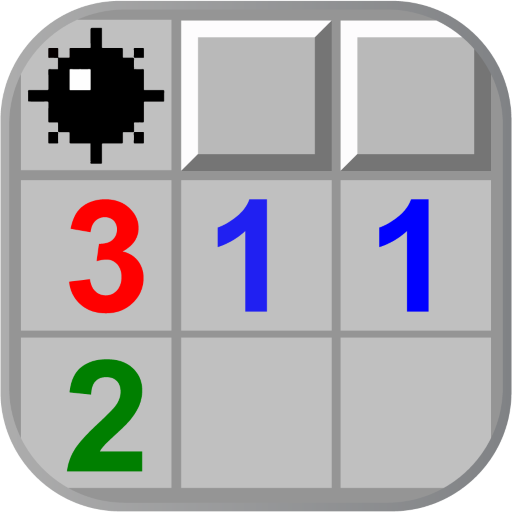
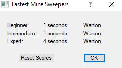

# []() Minesweeper Robot 
*Robot that plays minesweeper on any difficulty* 


*Made in python 3*



## Setup:

### 1) clone the repository

 - open git and change path to designated folder

```
$ git clone https://github.com/WANI0N/Minesweeper
```
 - [how to clone repository](https://docs.github.com/en/free-pro-team@latest/github/creating-cloning-and-archiving-repositories/cloning-a-repository)

### 2) install virtual env and packages

```
$ python -m venv venv

$ source venv/Scripts/activate

$ pip install -r requirements.txt
```
### 3) start Minesweeper game
 - download game [here](https://github.com/WANI0N/Minesweeper/raw/master/docs/Winmine__XP.zip)
 - run ``Winmine__XP.exe`` (original hash SHA256=BCFF89311D792F6428468E813AC6929A346A979F907071C302F418D128EAAF41)
 - execute script on ``main.py``

